# 🚀 **Projet Fullstack - Gestion des Produits et Catégories** 

## 📜 **Préambule**


Ce projet a pour objectif de démontrer mes compétences en **React.js** et **Symfony**. Il implique la création d'une application fullstack permettant de gérer des produits et des catégories via une API Symfony côté backend et un frontend en React.js.

---

## 🎯 **Objectif**

L'application permet de :
1. **Gérer les produits** : Créer, lire, mettre à jour et supprimer des produits.
2. **Gérer les catégories** : Créer, lire, mettre à jour et supprimer des catégories.
3. **Frontend React** : 

  
-Gérer l'affichage des données dans une interface utilisateur.

-Consommer l'API Symfony.

-Fournir des fonctionnalités de recherche, filtrage et tri des produits.

1. **Backend Symfony** : Fournir une API RESTful pour la gestion des produits et des catégories.

---

## ⚙️ **Choix Techniques**

### **Backend - Symfony** 

J'ai choisi **Symfony** pour le backend car il est l'un des frameworks PHP les plus robustes et mature pour créer des API RESTful. Il facilite la gestion des routes, la validation des données et l'intégration de la base de données. 

### **Frontend - React.js avec Vite**

J'ai utilisé **React.js** pour le frontend car c'est une bibliothèque moderne, performante et flexible pour créer des interfaces utilisateur dynamiques et réactives. 

J'ai opté pour **Vite** comme outil de développement pour React pour les raisons suivantes :
- **Temps de démarrage ultra-rapide** : Vite utilise *esbuild*, ce qui permet un démarrage presque instantané et une mise à jour rapide des fichiers modifiés.
- **Simplicité de configuration** : Vite nécessite peu de configuration, ce qui m'a permis de me concentrer sur le développement sans perdre de temps avec des réglages complexes.
### **Tailwind CSS**
J'ai aussi utilisé **Tailwind** pour la mise en page, ce qui permet de styliser l'application de manière modulaire et réutilisable 
### **Redux**
Pour gérer l'état global de l'application et assurer une synchronisation entre les différentes vues, j'ai utilisé **Redux**. Cela permet de centraliser la gestion de l'état des produits et des catégories, tout en facilitant la gestion des interactions utilisateur à travers l'application.
## 🛠  **Instructions d'Installation**
### Prérequis
Avant de commencer, assurez-vous d'avoir installé les éléments suivants sur votre machine :

**Node.js** (version 14 ou supérieure) : Vous pouvez télécharger Node.js ici : https://nodejs.org/
**PHP** (version 8.0 ou supérieure) : Téléchargez PHP à partir de https://www.php.net/downloads.php.
**Composer** : Le gestionnaire de dépendances PHP, nécessaire pour **Symfony**. Installez-le depuis https://getcomposer.org/download/.

### Étapes d'Installation
#### 1. Clonez le projet
```bash
git clone https://github.com/mohamedmaghzaoui/Product-Management-App.git
cd product-app
```
#### 2. Backend - Installation de Symfony
Accédez au dossier backend et installez les dépendances Symfony :
```bash
cd backend
composer install
```
#### 3. Frontend - Installation de React
Accédez au dossier frontend et installez les dépendances de React avec Vite :
```bash
cd frontend
npm install
```
#### 4. Lancer l'Application
**Backend** : Démarrez le serveur Symfony :
```bash
cd backend
symfony server:start
```
**Frontend** : Démarrez l'application React avec Vite :
```bash
cd frontend
npm run dev
```

L'application frontend sera accessible sur http://localhost:5173, et l'API backend sera disponible à http://localhost:8000.

## 📄  Gestion des Fichiers .env
Les fichiers .env jouent un rôle clé dans la configuration l'api en Symfony pour le backend et Vite pour le frontend.

#### 📂 Backend: Configuration des variables d’environnement
Dans le dossier backend, le fichier .env est utilisé pour configurer les variables essentielles à l’application Symfony. 
```bash
# Les fichiers .env permettent de configurer les variables d'environnement pour différentes situations :
# 1. .env : Fichier par défaut contenant les valeurs principales.
# 2. .env.local : Fichier local non versionné pour les surcharges spécifiques.
# 3. .env.$APP_ENV : Fichier pour des configurations spécifiques à l'environnement (dev, test, prod).
# 4. .env.$APP_ENV.local : Surcharges spécifiques pour chaque environnement (non versionné).

# Ne stockez PAS de secrets de production dans ce fichier ou dans tout autre fichier versionné.
# Utilisez les outils secrets Symfony : https://symfony.com/doc/current/configuration/secrets.html

###> symfony/framework-bundle ###
# Environnement de l'application (dev, prod, test)
APP_ENV=dev
# Clé secrète de l'application, à générer pour chaque projet
APP_SECRET=your_secret_key_here
###< symfony/framework-bundle ###

###> doctrine/doctrine-bundle ###
# URL de connexion à la base de données

DATABASE_URL=""
###< doctrine/doctrine-bundle ###

###> nelmio/cors-bundle ###
# Configuration CORS (Cross-Origin Resource Sharing)
# Permettre l'accès uniquement à localhost pour les environnements de développement
CORS_ALLOW_ORIGIN='^https?://(localhost|127\.0\.0\.1)(:[0-9]+)?$'
###< nelmio/cors-bundle ###
```
#### 📂 Frontend: Configuration avec Vite
Dans le dossier frontend, le fichier .env contient des variables spécifiques pour l’application React.js
```bash
# URL de l'API Backend
VITE_API_URL=http://localhost:8000
```
## 🧑‍💻 **Description des Routes API**

### **Produits**

- **POST** `/products`: Crée un nouveau produit.
  - **Body**:
    ```json
    { 
      "name": "Nom du produit", 
      "description": "Description du produit", 
      "price": 99.99, 
      "category": 1 
    }
    ```
  - **Response**: `201 Created` en cas de succès.

- **GET** `/products`: Récupère tous les produits.
  - **Response**: 
    ```json
    [
      {
        "id": 1,
        "name": "Produit 1",
        "description": "Description du produit 1",
        "price": 99.99,
        "category": 1,
        "createdAt": "2024-12-04T12:00:00"
      },
      {
        "id": 2,
        "name": "Produit 2",
        "description": "Description du produit 2",
        "price": 49.99,
        "category": 2,
        "createdAt": "2024-12-04T12:05:00"
      }
    ]
    ```

- **PUT** `/products/{id}`: Modifie un produit existant.
  - **Body**:
    ```json
    { 
      "name": "Produit mis à jour", 
      "description": "Nouvelle description du produit", 
      "price": 129.99, 
      "category": 1 
    }
    ```
  - **Response**: `200 OK` en cas de succès.

- **DELETE** `/products/{id}`: Supprime un produit.
  - **Response**: `200 OK` en cas de succès.

### **Catégories**

- **POST** `/categories`: Crée une nouvelle catégorie.
  - **Body**:
    ```json
    { 
      "name": "Catégorie 1" 
    }
    ```
  - **Response**: `201 Created` en cas de succès.

- **GET** `/categories`: Récupère toutes les catégories.
  - **Response**: 
    ```json
    [
      {
        "id": 1,
        "name": "Catégorie 1"
      },
      {
        "id": 2,
        "name": "Catégorie 2"
      }
    ]
    ```

- **PUT** `/categories/{id}`: Modifie une catégorie existante.
  - **Body**:
    ```json
    { 
      "name": "Catégorie mise à jour" 
    }
    ```
  - **Response**: `200 OK` en cas de succès.

- **DELETE** `/categories/{id}`: Supprime une catégorie.
  - **Response**: `200 OK` en cas de succès.
# 📸 Capture d'écran


## :clipboard: Liste des produits et catégories
Voici l'écran affichant la liste des produits et des catégories.

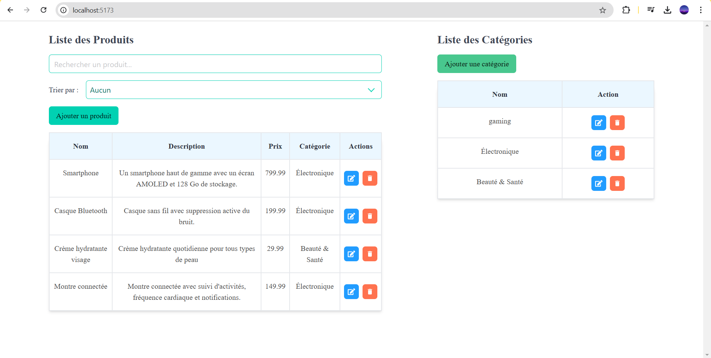
*Capture d'écran de la liste des produits et des catégories.*

## :label: Ajouter une catégorie
Voici l'écran pour ajouter une nouvelle catégorie.

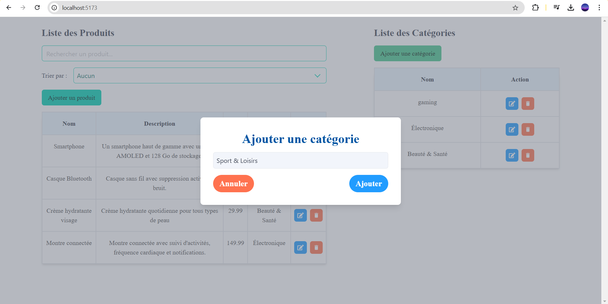
*Capture d'écran de l'écran d'ajout d'une catégorie.*

## :white_check_mark: Catégorie ajoutée
Voici l'écran après l'ajout d'une nouvelle catégorie.


*Capture d'écran de la catégorie ajoutée avec succès.*

## :pencil: Modifier une catégorie
Dans cette section, vous pouvez voir comment modifier une catégorie existante.

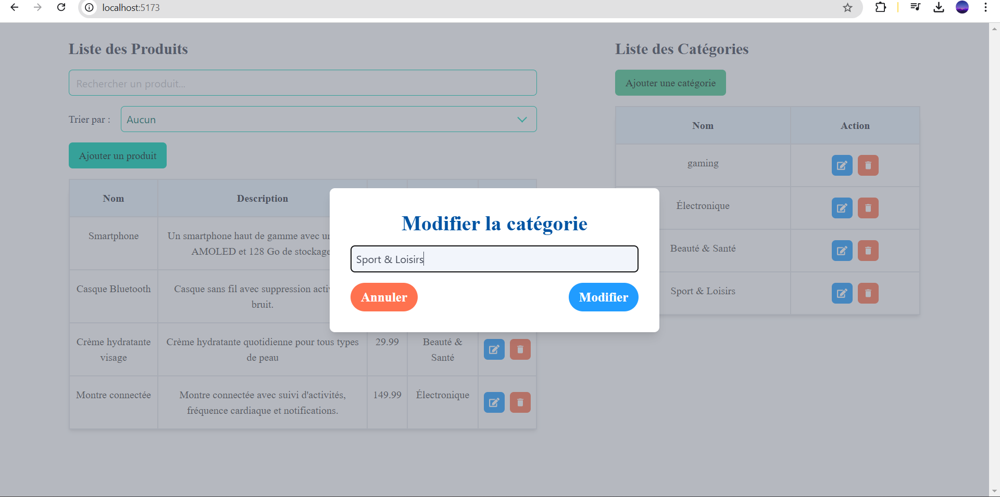
*Capture d'écran de l'écran de modification de la catégorie.*

## :package: Ajouter un produit
Voici comment ajouter un produit dans l'application.

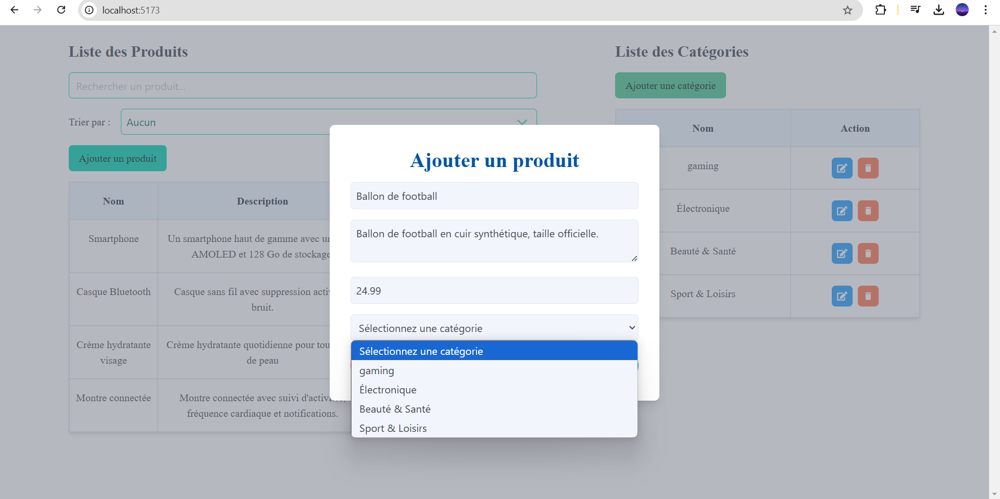
*Capture d'écran de l'écran où vous ajoutez un produit.*

## :heavy_check_mark: Produit ajouté
Voici l'écran affichant qu'un produit a été ajouté avec succès.

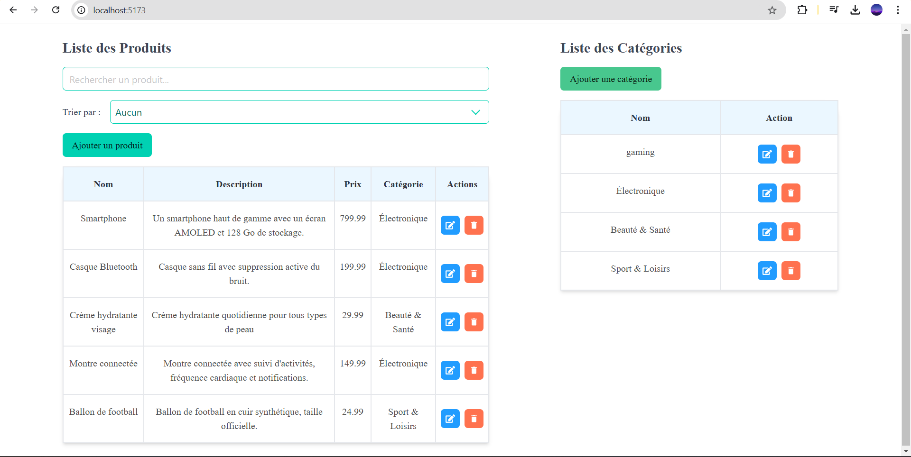
*Capture d'écran après l'ajout d'un produit.*

## :pencil2: Modifier un produit 
Voici l'écran pour modifier un produit dans l'application.


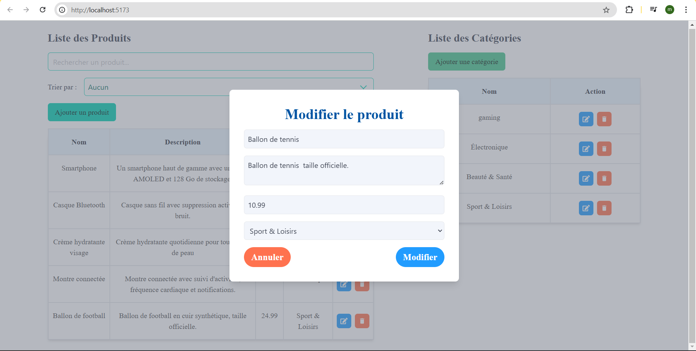
*Capture d'écran de la modification d'un produit.*

## :heavy_check_mark: Produit modifé
Voici l'écran affichant qu'un produit a été modifié avec succès.


*Capture d'écran après la modification d'un produit.*

# ⚠️ Affichage des messages d'erreur

L'écran où vous pouvez voir les messages d'erreur.

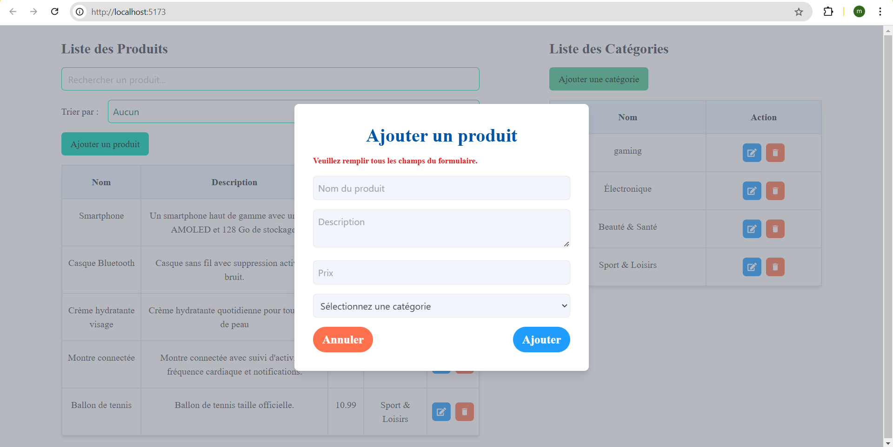 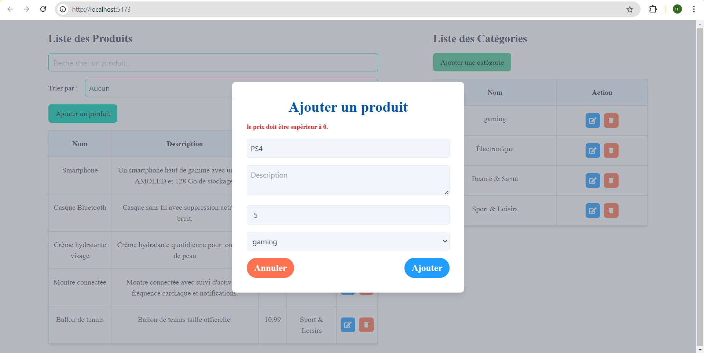

Capture d'écran des messages d'erreur affichés.


## :mag: Rechercher un produit
Voici l'écran où vous pouvez rechercher un produit.

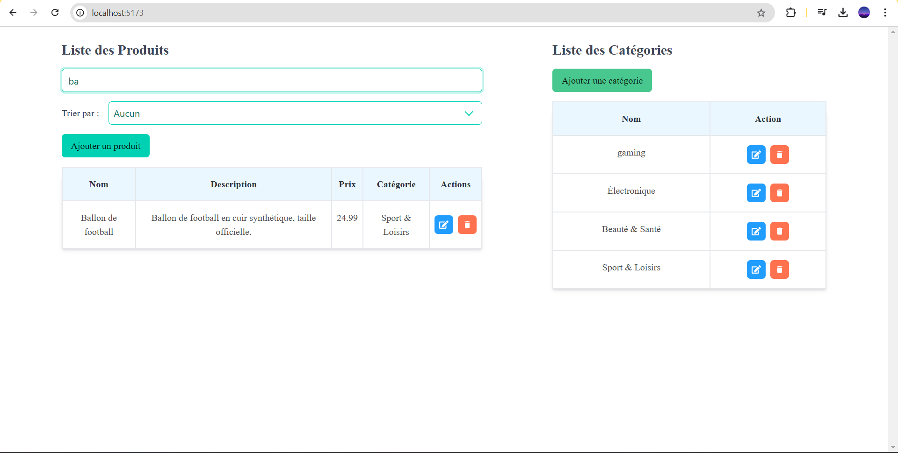
*Capture d'écran de la fonction de recherche de produit.*

## :arrows_counterclockwise: Trier par catégories
Cette image montre l'écran où vous pouvez trier par catégories.


*Capture d'écran de l'écran de tri des catégories.*

## :arrow_up: Trier par prix croissant
Cette image montre l'écran de tri des produits par prix croissant.

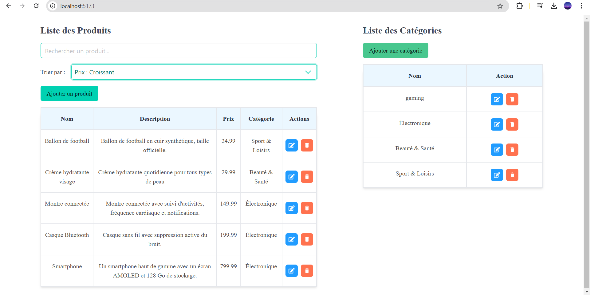
*Capture d'écran de l'écran de tri par prix croissant.*

## :mag_right: Trier et rechercher un produit
L'écran où vous pouvez trier et rechercher des produits.

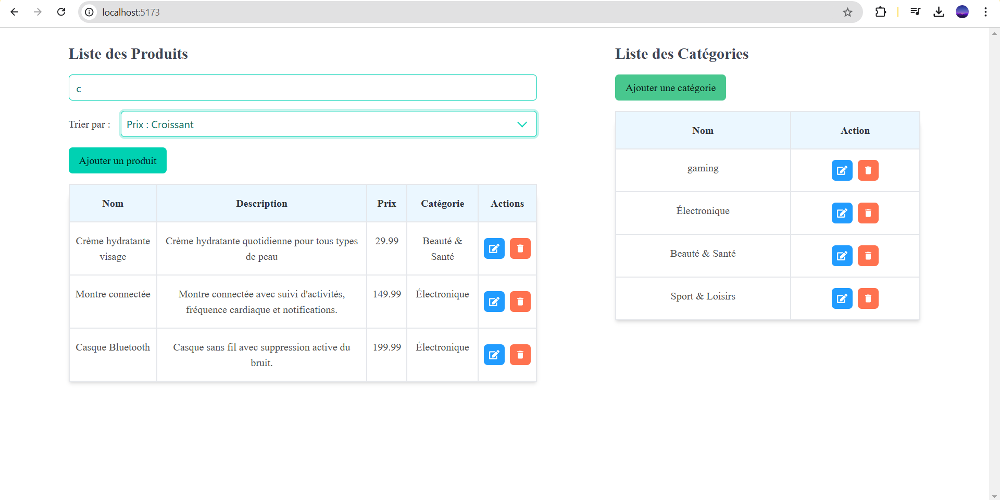
*Capture d'écran de l'écran de tri et de recherche.*
